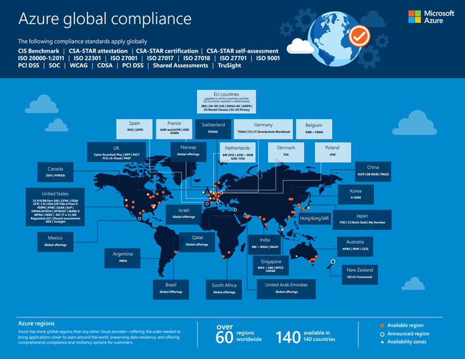
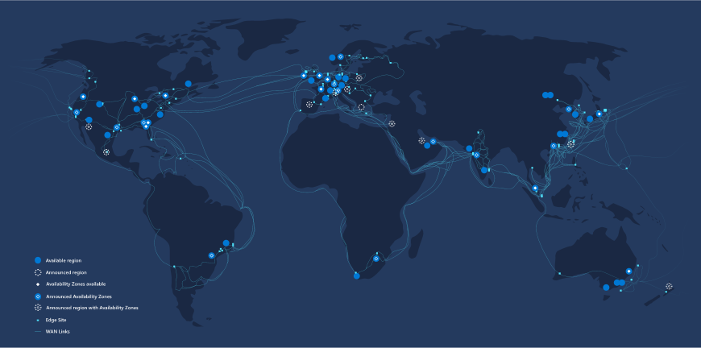
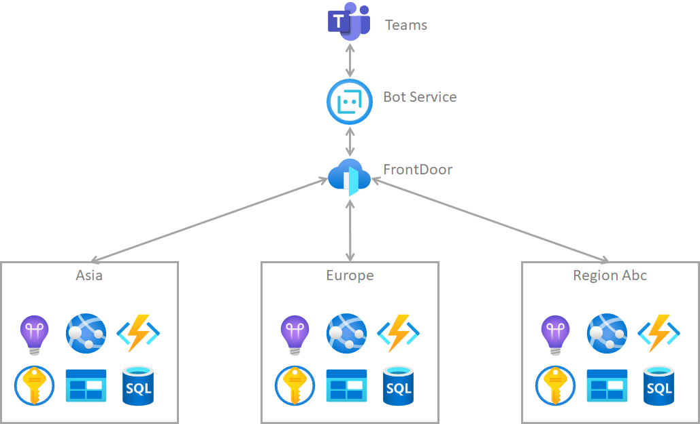

我在之前的一篇博客里面讲了合规性对于我们Teams app是非常重要的，因为office365平台就是面向全世界用户的，我们开发的teams app一旦发布后，立刻就会有各国各地区的用户来进行安装使用，所以符合用户所在地区的要求是非常重要的。

很多读者来信问合规性这么难做，而且不同地区的要求可能是相互冲突的，有没有什么好的方法或者是平台来方便开发者呢。

实际上大家正在使用的Azure就是一个非常好的平台，他自己本身已经符合了各个地区的合规性要求，见下图：



[微软白皮书](https://azure.microsoft.com/en-us/resources/azure-global-compliance-map/)

当我们把我们开发的teams app也部署到azure平台上，实际上已经站在了巨人的肩膀上，已经符合了一部分的地区要求了。

对于数据保存地问题，现在全球的各个商业软件平台越来越倾向于就地存储，比如如果这个用户是一个欧盟的用户，那数据就保存在欧盟的Azure机房里，如果用户是中国用户，那数据就保存在中国。Azure目前已经涵盖了全世界大部分区域，所以我们可以让我们teams app的用户根据用户所处租户的区域，把数据进行保存。



当我们把数据保存到不同区域，但是对于Teams来说，我们还是要暴露出一个统一的接入点。这时候可以使用Azure的front door服务，这个服务是一个global服务，它目前全球由90个节点组成。我们可以使用类似于下面的这个infrastructure架构。



把Azure FrontDoor的url配置到teams bot service里面，然后在不同区域部署符合不同区域合规性要求的服务，FrontDoor把这些区域都联合在一起。

FrontDoor服务非常好用，如果你还没有用过，记得尝试一下。它帮我们解决了很多全球部署里会遇到的各种问题。

到这里，大家可能会问，我们的teams app如何来判断当前用户的租户的地区或者国家呢？我们可以使用Graph API的一个接口来实现：
```
GET /organization
```

这个接口返回的json格式如下：
```js
{
	"@odata.context": "https://graph.microsoft.com/v1.0/$metadata#organization",
	"value": [{
		"id": "dcd219dd-1111-2222-3333-4a33a796be35",
		"city": "redmond",
		"country": null,
		"countryLetterCode": "US",
		"createdDateTime": "2017-07-29T02:16:17Z",
		"displayName": "Contoso",
		"marketingNotificationEmails": [],
		"onPremisesLastSyncDateTime": null,
		"onPremisesSyncEnabled": null,
		"postalCode": "98052",
		"preferredLanguage": "en",
		"privacyProfile": null,
		"state": "WA",
		"street": "1 microsoft way",
                                        ……
	}]
}
```

可以看到`countryLetterCode`是一个可以拿来判断的属性，如果需要再细致一些，可以使用`state`属性。

要实现Teams App的全球合规性实际上工作量不小，但是有了azure平台后，事半功倍

