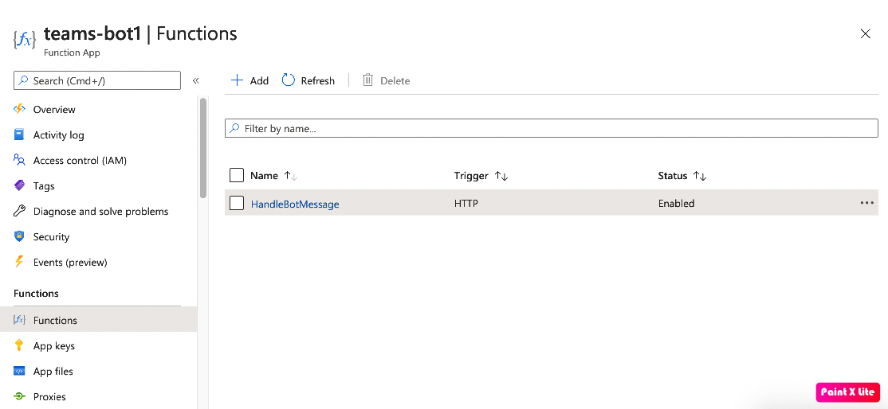
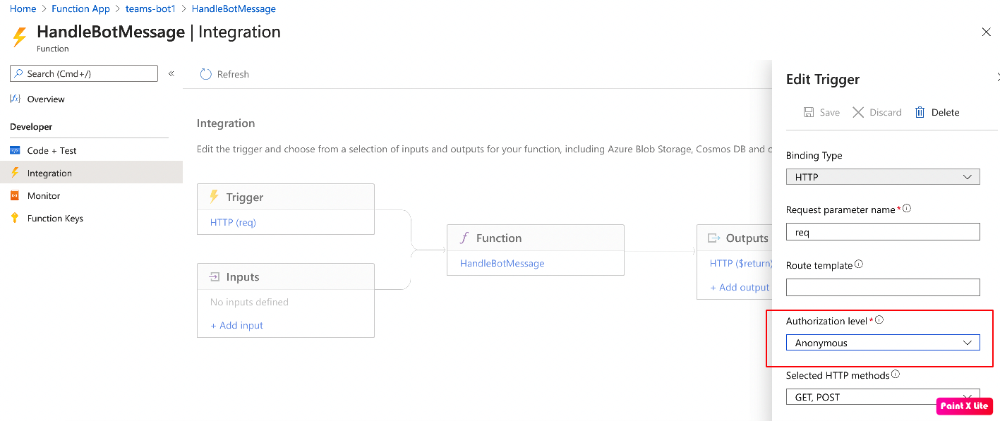
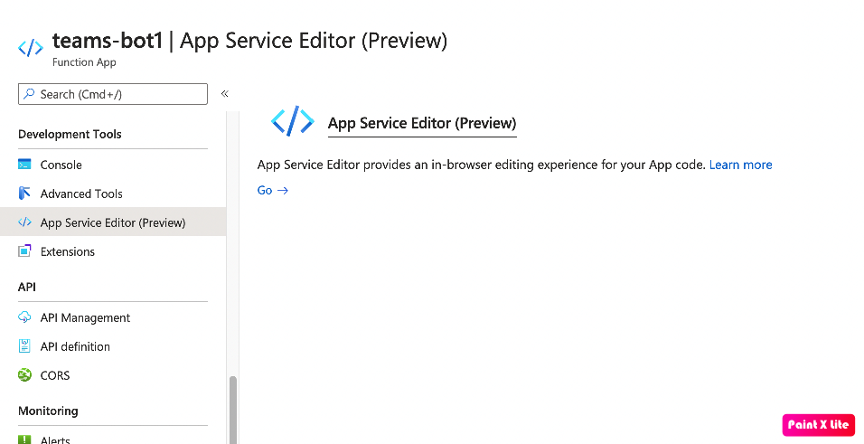
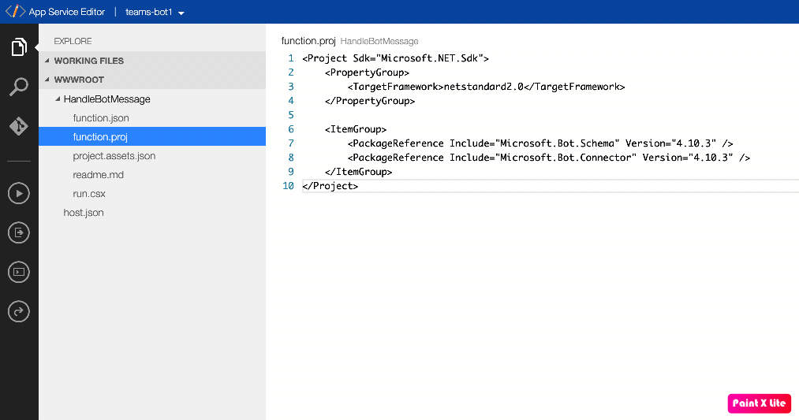

之前我有一篇文章讲了如何在azure function上开发最简单的outgoing webhook，收到一些反馈，建议我介绍一下如果在azure function上开发teams bot，那这篇文章就来讲一下如何用function来快速开发bot。

我们先创建一个azure function资源，然后创建一个由http触发的Function。具体步骤和上次outgoing webhook的步骤类似，我就不再重复。



为了调试方便，我这里允许匿名访问这个function。



创建完function后，我们就可以输入下面的代码：

```csharp
#r "Newtonsoft.Json"

using System;
using Microsoft.AspNetCore.Mvc;
using Newtonsoft.Json;
using Microsoft.Bot.Connector;
using Microsoft.Bot.Connector.Authentication;
using Microsoft.Bot.Schema;

public static async Task<IActionResult> Run(HttpRequest req, ILogger log)
{
    string requestBody = await new StreamReader(req.Body).ReadToEndAsync();
    log.LogInformation(requestBody);

    var activity = JsonConvert.DeserializeObject<Activity>(requestBody);
    var reply = activity.CreateReply("Echo: " + activity.Text);
    log.LogInformation(JsonConvert.SerializeObject(reply));

    MicrosoftAppCredentials.TrustServiceUrl(activity.ServiceUrl, DateTime.UtcNow.AddDays(7));
    var botId = "2a820a1c-1111-2222-3333-e8864ad6ff54"; // your bot id
    var botPassword = Environment.GetEnvironmentVariable("BotPassword"); // your bot password
    var connector = new ConnectorClient(new Uri(activity.ServiceUrl), botId, botPassword);
    connector.Conversations.SendToConversationAsync(reply);
    return new OkResult();
}
```

上面的代码先从http请求的request body里反序列化出 `Activity` 对象。

```cs
var activity = JsonConvert.DeserializeObject<Activity>(requestBody);
```

然后从这个activity对象，创建出回复的消息。

```cs
var reply = activity.CreateReply("Echo: " + activity.Text);
```

接着，创建 `connector` 对象，然后用这个对象来发送回复的消息：

```cs
var connector = new ConnectorClient(new Uri(activity.ServiceUrl), botId, botPassword);
connector.Conversations.SendToConversationAsync(reply);
```

在发送回复消息之前，我们需要trust teams的serive url。
```cs
MicrosoftAppCredentials.TrustServiceUrl(activity.ServiceUrl, DateTime.UtcNow.AddDays(7));
```

当我们保存上面的代码的时候，azure function 就会自动进行编译，但是编译失败，原因是 `Microsoft.Bot.*` 命名空间找不到，因为我们还没有引用对应的库。我们进入 App Service Editor (目前还是preview版本)，在我们的function的目录下创建一个 `function.proj` 文件。





`function.proj` 文件内容如下：

```xml
<Project Sdk="Microsoft.NET.Sdk">
    <PropertyGroup>
        <TargetFramework>netstandard2.0</TargetFramework>
    </PropertyGroup>

    <ItemGroup>
        <PackageReference Include="Microsoft.Bot.Schema" Version="4.10.3" />
        <PackageReference Include="Microsoft.Bot.Connector" Version="4.10.3" />
    </ItemGroup>
</Project>
```

回到function后，重新执行，就可以成功编译执行了。

完成了function后，我们就可以和普通的bot一样的在teams里创建一个bot app，然后填入azure function的url，就可以测试我们的bot了。 :D
