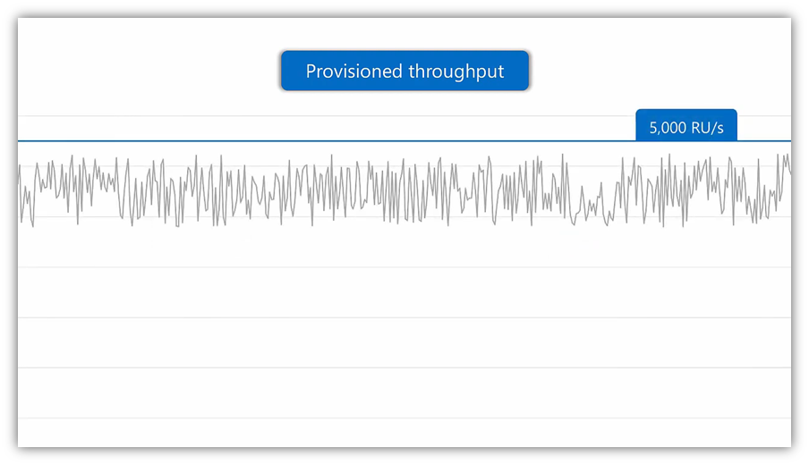
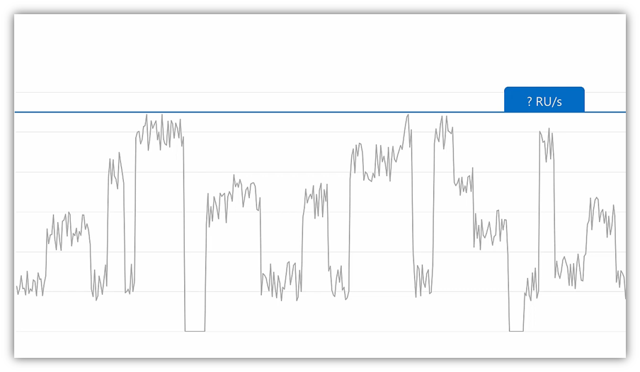
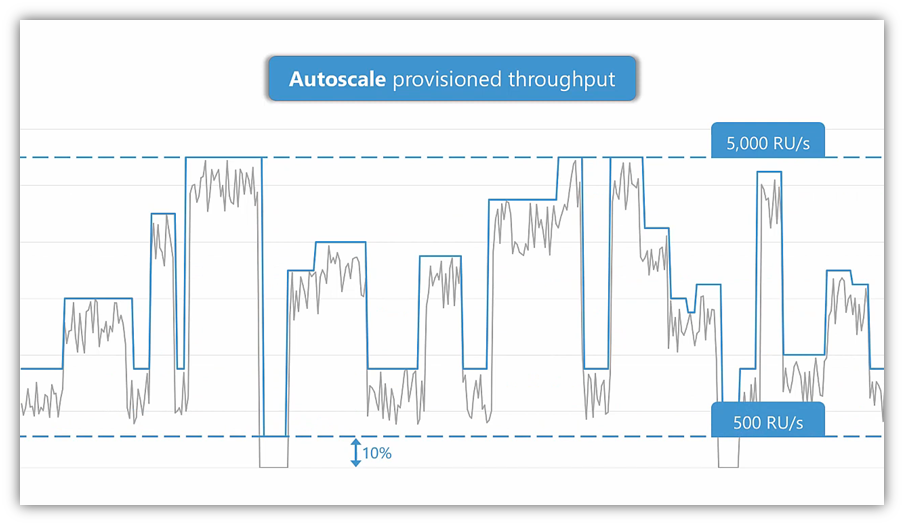
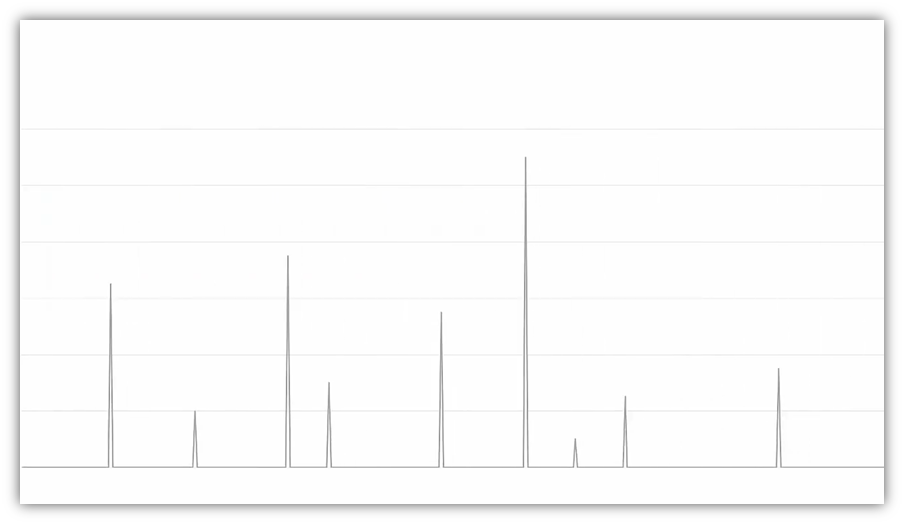
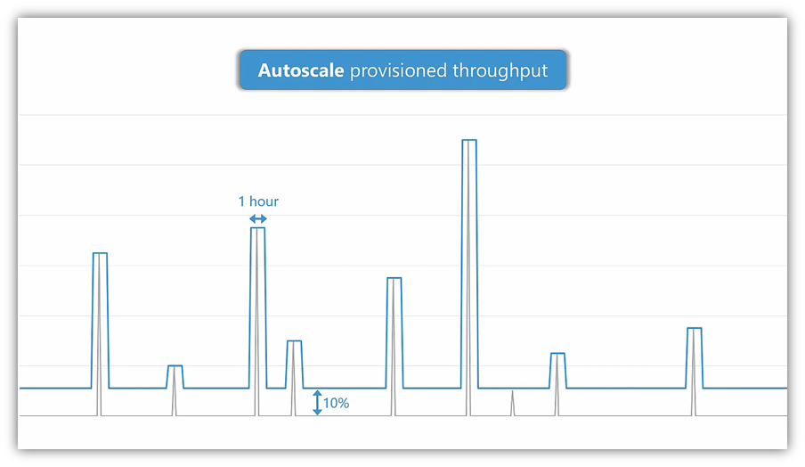
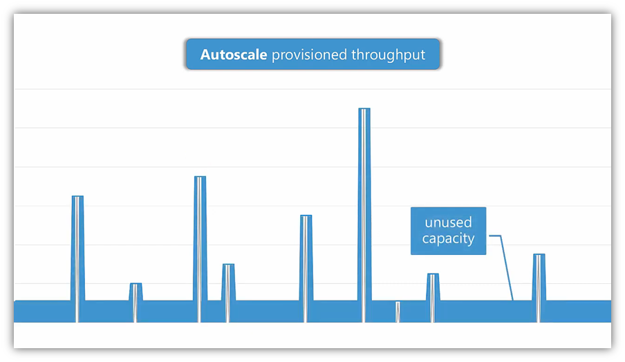
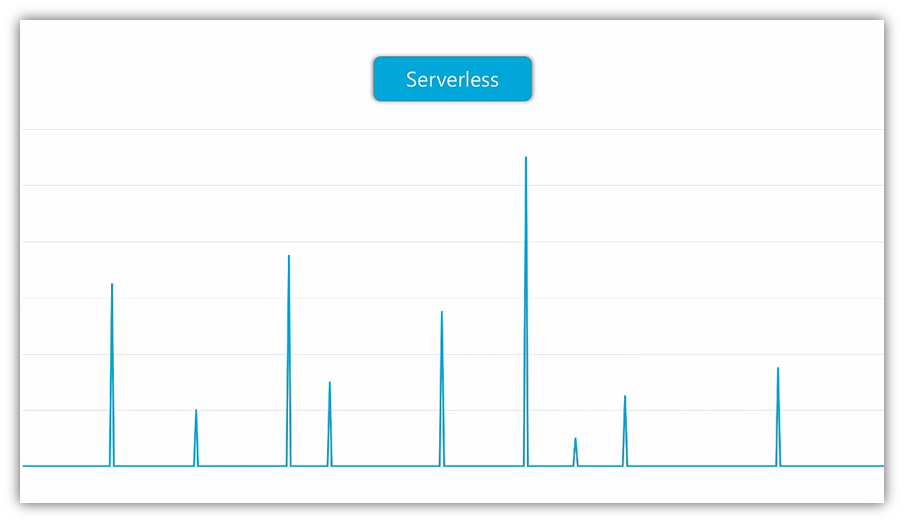

我在以前的博客里说过我的LuckyDraw app在数据存储方面使用的是 Azure Table Storage，当时选择这个的原因是成本考虑，因为它实在是便宜，对于我这种个人开发维护的免费的teams app来说，成本是一个很重要的考量点。

当然，我也为这个运营成本的节省，付出了很多开发成本。因为针对Table Storage，在代码开发，业务逻辑处理，开源库的支持度等方面，比传统的数据库复杂很多。最简单的一个例子是，当需要保存一个大的json的时候，在SQL，我们可以简单的使用`nvarchar(max)`，在table storage里，需要把列拆分成很多小的列进行保存，读取时也需要读取多个列的数据然后进行拼接处理。十分复杂。而且自动化测试的时候，也没有类似 EntityFramework Core的in-memory db。

当时在设计时，我也考虑过CosmosDB，这个是更加符合未来发展趋势的数据库，它的优点我就不再在这里重复了。我最后没有采用它的唯一的原因就是当时太贵了，最最起步的配置是400RU/s，也就是说我的测试环境和开发环境，即使平时不怎么使用，这400RU/s的钱还是要付的。

随着cosmos db的普及和发现，最近有一些新的收费方式出来，我就在第一时间去研究了一下。

下图是传统的方式Provisioned throughput，灰色的上下浮动变化的线是假设的使用量，为了保证这个使用量，一般就需要配置一个略高于使用量的RU值，这里就用 5000 RU/s 作为例子。所以系统收费的时候就按照 5000 RU/s 来收费。

但是我们通常的系统不会上上图那样负载一直保持在一个相对稳定的高位，真实的情况更像下图，使用量随着时间有高有低，比如晚上或者周末可能低一些，这个时候为了满足最高的使用峰值，如果使用传统方式，我们还是需要配置成 5000 RU/s，但是大家可能已经发现了，在使用低谷时，5000 RU/s 是一种很大的浪费。

针对上面这种情况，Cosmos DB推出了 Autoscale 收费模式，我们可以设置一个最大值，比如 5000 RU/s，Cosmos DB平台会自动根据你的使用量的高低来变化 RU/s，当你的使用量不大的时候，RU/s就降低，但是最低不会低于最高值的10%，这里是 500 RU/s，当使用量增加时，Cosmos DB自动增加 RU/s，最高可以达到你设置的上限。这样在收费时，就是根据实际分配的 RU 来计算。可以看到这种模式下，我们可以省下很多费用。

但是如果对于一个使用率很低的系统来说，比如下图，如果是一个测试环境，那可能用户在测试时才用一会儿，大多数时间都是空置状态。

如果还是使用Autoscale模式，可以看到如下图。因为有一个最低的10%的保留量，和auto scale的时间问题，cosmos db收取的费用还是有一部分浪费了。

好在Cosmos DB最近推出了 serverless 模式，虽然在我写这篇文章的时候还是在 preview 状态。可以看到如下图，serverless收费是真正按照调用量来的，有一次算一次，用多少算多少。

看到这里，我相信大家和我有一样的想法，还在等什么呢？是时候开始使用CosmosDB了！

