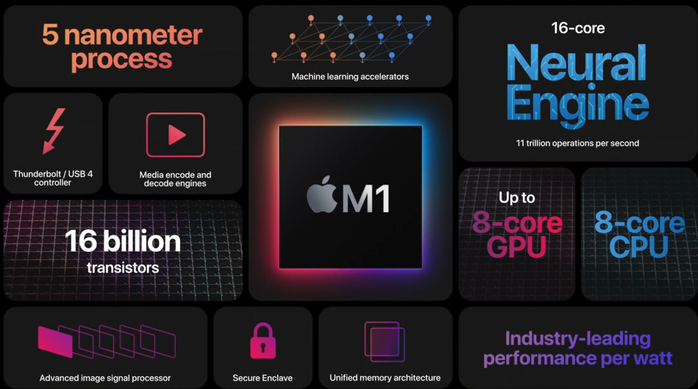
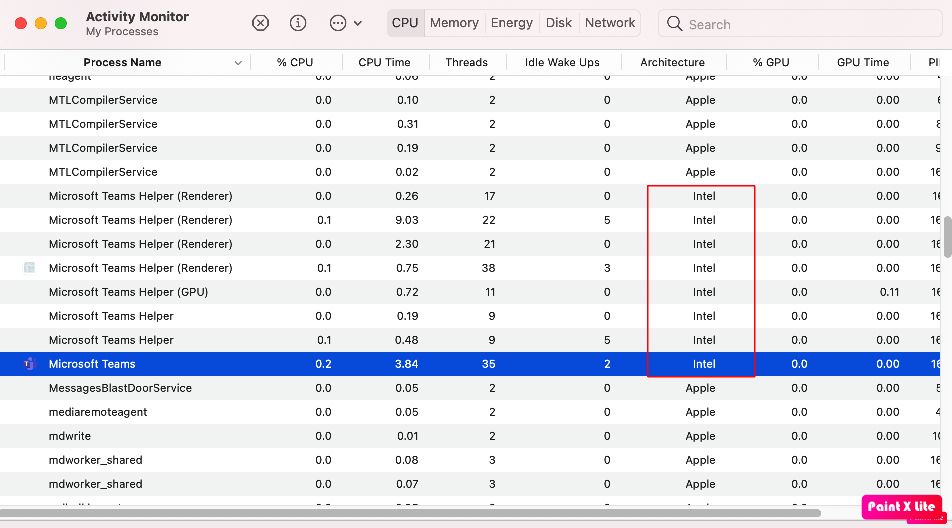

apple 在几个月前发布了自家的芯片 M1，由于将多核cpu，多核gpu，神经网络运算，内存和其他一切处理部件高度整合在一起，大大提高数据传输速度。发布后好评如潮，我也没有忍住，入手了一台最低配的mac air m1。目前 M1 还是有很多软件不能很好支持，当然，这个无法阻挡我在上面的开发。我给大家分享一下我在apple silicon上开发的过程。

首先，到写这篇文章的时候还有很多开发软件不支持跑在M1上，我们来看看当前的状态。

1. Docker正式发布版本不原生支持 apple silicon，preview 版本已经开始支持，但目前问题较多
2. VScode正式发布版本不原生支持，insider版本已经开始支持，但目前问题较多
3. .NET目前的LTS版本3.1和最新的5.0都不原生支持，目标是6.0版本支持
4. NodeJS preview版本支持
5. Python支持

所以，如果大家是JS, Python语言技术栈的话，恭喜，你已经开始在 M1 上进行原生开发了，只是目前大多数都在preview阶段。

如果你和我一样是 .NET 技术栈的话，一种方式是使用 Rosetta 来转换，但是转换的话就无法体验 M1 给我们带来的快感。网上有一个视频比较 VScode 启动速度的，使用 Rosetta 转换的话，明显慢，大概需要 5-8 秒，但是如果是原生的话，基本是瞬间就完成了（1秒以内）。

所以我使用的是另外一种方式，VScode remote，我在azure上开了一台虚机，vscode使用ssh的方式远程上去。下面是一些操作的链接

* VScode insider build for Apple Silicon (ARM64) [https://code.visualstudio.com/insiders/](https://code.visualstudio.com/insiders/)
* 配置SSH远程开发的步骤 [https://code.visualstudio.com/docs/remote/ssh](https://code.visualstudio.com/docs/remote/ssh)
* 在远程虚机上安装.net [https://docs.microsoft.com/en-gb/dotnet/core/install/linux](https://docs.microsoft.com/en-gb/dotnet/core/install/linux)

使用云端的虚机的好处是：你已经有一个public地址，所以不需要安装 ngrok 软件，可以直接把虚机的 ip 地址直接给到 teams，只需要记得打开对应的端口就可以了。如果你的虚机不是在云端的，那需要单独再安装 ngrok。

我的虚机是 ubuntu 20.04 LTS版本，如果你使用的是 windows 的远程虚机，那需要安装 openssh，但是这里有一个坑，我之前就掉进去，花了3，4小时才发现是一个已知问题，就是如果你的机器名字和用户名是一样的话，就死活登入不了。

另外，我自己的经验是，远程开发机器尽量使用 linux。这样如果你用来开发 python 或者 docker 相关的东西也会少遇到很多坑。

One more thing，目前 Teams 本身还不支持 M1，相信这个会被很快解决，因为 Electron 最近也已经支持了 apple silicon 了。[https://www.electronjs.org/blog/electron-11-0](https://www.electronjs.org/blog/electron-11-0)

最后，如果大家对目前各大软件支持apple silicon的进度感兴趣的话，可以访问这个网站，非常实用：[https://isapplesiliconready.com/for/developer](https://isapplesiliconready.com/for/developer)
