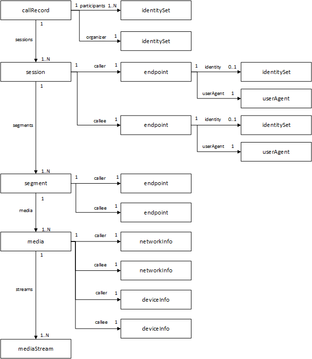

上篇文章介绍了如何获取用户的在线状态，这篇文章我们记录介绍如何统计用户通话记录。

首先，Teams为了安全，它要求 app 要有 `CallRecords.Read.All` 权限。然后就可以通过这个api来获取 call record。

```
GET /communications/callRecords/{id}
```

这个接口会返回类似如下的数据：

```json
{
    "@odata.context": "https://graph.microsoft.com/beta/$metadata#communications/callRecords/$entity",
    "version": 1,
    "type": "groupCall",
    "modalities": [
        "audio"
    ],
    "lastModifiedDateTime": "2020-12-25T19:00:24.582757Z",
    "startDateTime": "2020-12-25T18:52:21.321Z",
    "endDateTime": "2020-12-25T19:52:46.123Z",
    "id": "e523d2ed-1111-4b6b-925b-754a88034cc5",
    "organizer": {
        "user": {
            "id": "821809f5-0000-0000-0000-3b5136c0e777",
            "displayName": "Abbie Wilkins",
            "tenantId": "dc368399-474c-4d40-900c-6265431fd81f"
        }
    },
    "participants": [
        {
            "user": {
                "id": "821809f5-0000-0000-0000-3b5136c0e777",
                "displayName": "Abbie Wilkins",
                "tenantId": "dc368399-474c-4d40-900c-6265431fd81f"
            }
        },
        ...
    ]
}
```

可以看到，我们能通过 `organizer` 和 `participants` 来找到参与这个通过的参与人，我们可以记录下用户的 user id，同时我们还可以通过 `startDateTime` 和 `endDateTime` 来取得这次 call 的开始和结束时间。

实际上 Teams 里的 call record 比我们想象的复杂很多，一个call里可能有多个 session 组成，我们用一张官方的数据模型图看一下。



我们可以给上面这个 api 加上参数来获取 session。
```
GET https://graph.microsoft.com/beta/communications/callRecords/{id}?$expand=sessions
```
```json
{
    "@odata.context": "https://graph.microsoft.com/beta/$metadata#communications/callRecords(sessions(segments()))/$entity",
    "startDateTime": "2020-02-25T18:52:21.2169889Z",
    "endDateTime": "2020-02-25T18:52:46.7640013Z",
    "organizer": { ... },
    "participants": [ ... ],
    "sessions": [
        {
            "modalities": [
                "audio"
            ],
            "startDateTime": "2020-02-25T18:52:21.2169889Z",
            "endDateTime": "2020-02-25T18:52:46.7640013Z",
            "id": "e523d2ed-2966-4b6b-925b-754a88034cc5",
            "caller": {
                "@odata.type": "#microsoft.graph.callRecords.participantEndpoint",
                "userAgent": {
                    "@odata.type": "#microsoft.graph.callRecords.clientUserAgent",
                    "headerValue": "RTCC/7.0.0.0 UCWA/7.0.0.0 AndroidLync/6.25.0.27 (SM-G930U Android 8.0.0)",
                    "platform": "android",
                    "productFamily": "skypeForBusiness"
                },
                "identity": {
                    "@odata.type": "#microsoft.graph.identitySet",
                    "user": {
                        "id": "821809f5-0000-0000-0000-3b5136c0e777",
                        "displayName": "Abbie Wilkins",
                        "tenantId": "dc368399-474c-4d40-900c-6265431fd81f"
                    }
                }
            },
            "callee": {
                "@odata.type": "#microsoft.graph.callRecords.participantEndpoint",
                "userAgent": {
                    "@odata.type": "#microsoft.graph.callRecords.clientUserAgent",
                    "headerValue": "UCCAPI/16.0.12527.20122 OC/16.0.12527.20194 (Skype for Business)",
                    "platform": "windows",
                    "productFamily": "skypeForBusiness"
                },
                "identity": {
                    "user": {
                        "id": "f69e2c00-0000-0000-0000-185e5f5f5d8a",
                        "displayName": "Owen Franklin",
                        "tenantId": "dc368399-474c-4d40-900c-6265431fd81f"
                    }
                },
                "feedback": {
                    "rating": "poor",
                    "tokens": {
                        "NoSound": false,
                        "OtherNoSound": false,
                        "Echo": false,
                        "Noisy": true,
                        "LowVolume": false,
                        "Stopped": false,
                        "DistortedSound": false,
                        "Interruptions": false
                    }
                }
            }
        }
    ]
}
```

从上面返回的json可以看到，session里有 `startDateTime` 和 `endDateTime`。还有 `caller` 和 `callee`，我们用这些数据来进行进一步的深入统计，而且可以看到里面还有每个用户参与这个通话是使用的设备（`userAgent.platform`），更有意思的是，这里面还有 `feedback`，里面有这个用户这次通话中音质是好还是差，有没有噪音等等。有了这些信息，相信大家脑海里已经有了大量的可以统计的点了。

各位看到这里，可能会问，上面的接口是获取某一次 call record 的，那我如何获取所有的记录呢？

这里就需要用到 graph api 的订阅功能。
```
POST https://graph.microsoft.com/beta/subscriptions
```
```json
{
   "changeType": "created",
   "notificationUrl": "https://<<your api url>>",
   "resource": "/communications/callRecords",
   "expirationDateTime":"2016-11-20T18:23:45.9356913Z",
   "clientState": "secretClientValue",
   "latestSupportedTlsVersion": "v1_2"
}
```

上面的 `resource` 是 `/communications/callRecords`，表明如果有任何一个call发生，graph api会回调我们的接口。上面的 `"notificationUrl": "https://<<your api url>>"` 是你的服务的回调 url，我们可以在这个接口里得到相应的 call record id，并且记录下来，等一段时间call 结束后，就可以获取整个call的信息了。
